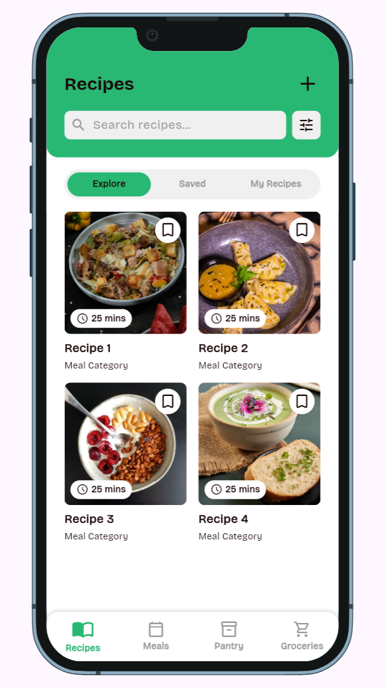
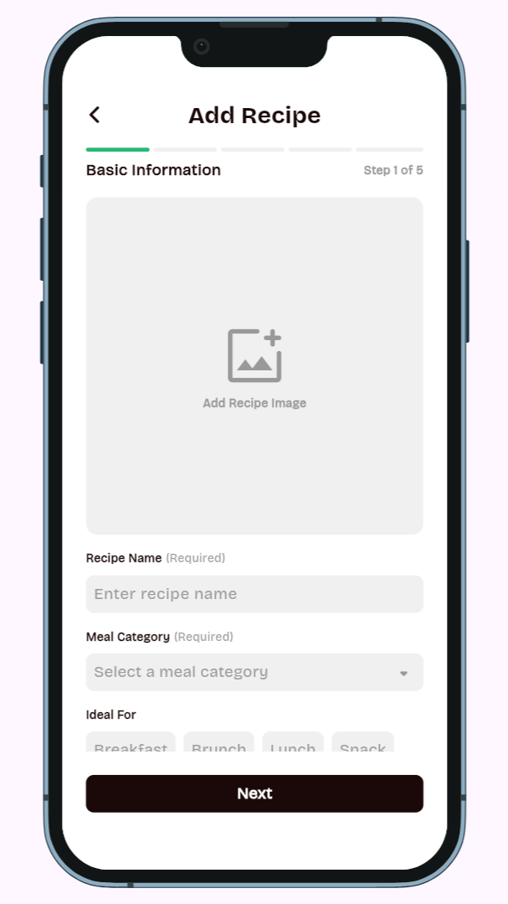
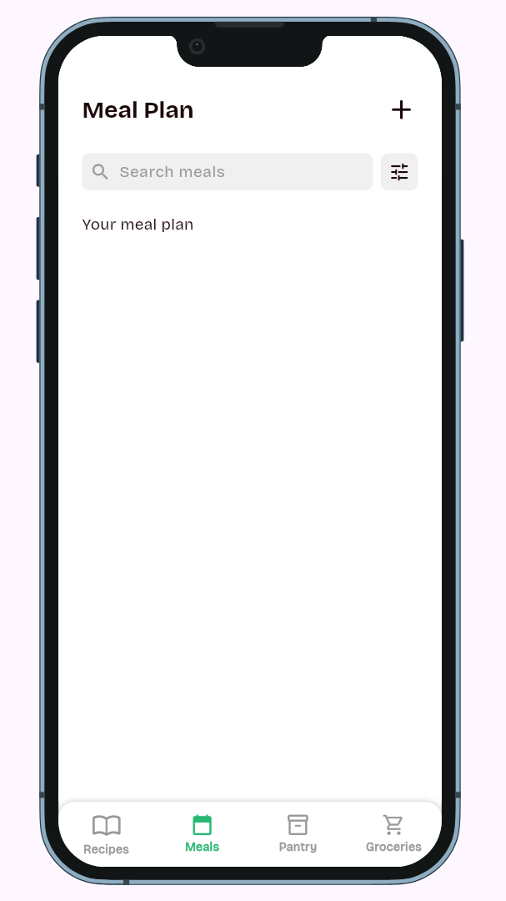
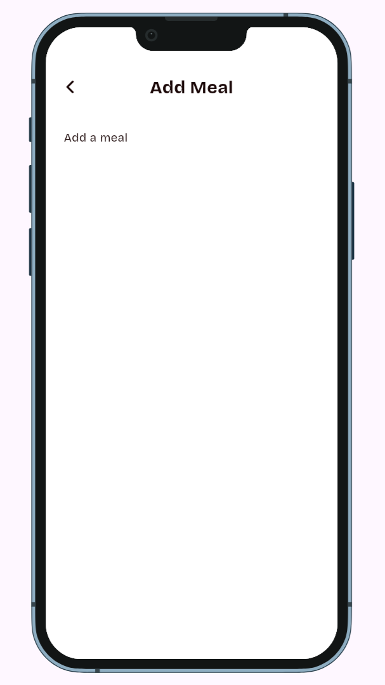
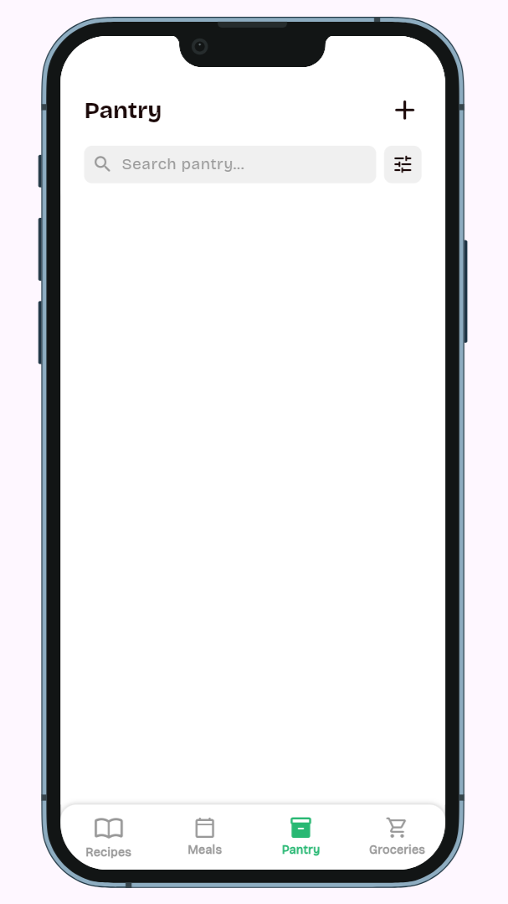
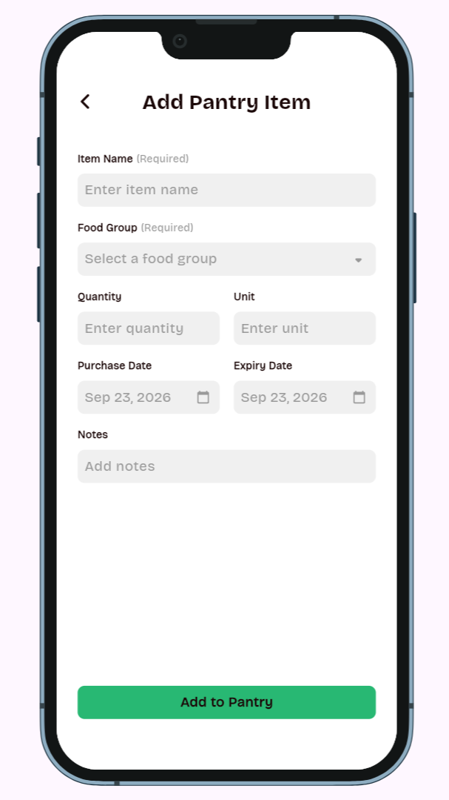
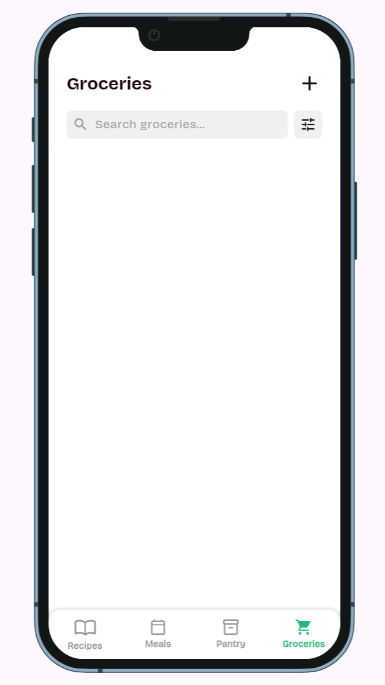
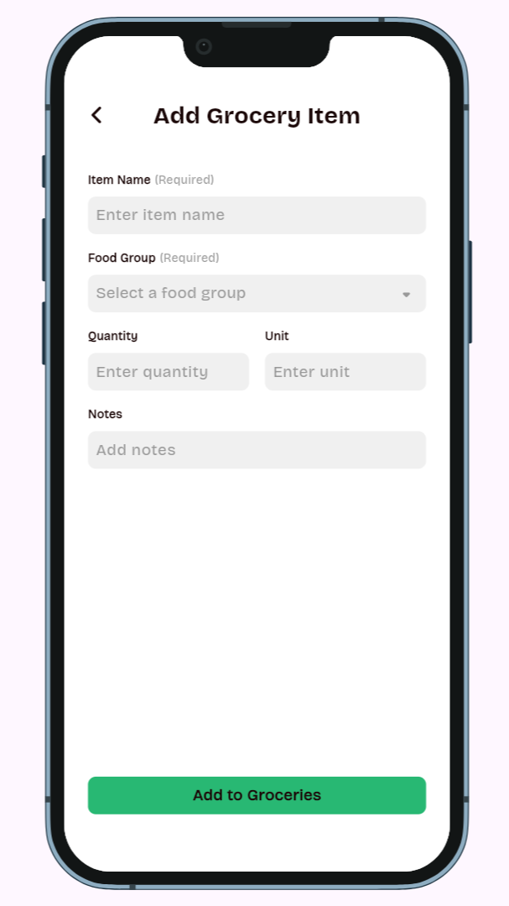

# Asan

**Live demo:** https://astherem.github.io/ASAN/ <br>
**Demo video:** To be added after recording. <br>
**Course:** Applications Development and Emerging Technologies (6ADET), Holy Angel University <br>
**Author:** astherem

## 1. Overview

Asan is a Flutter-based food and meal planning app designed to help people track groceries, manage pantry stock, and save or explore recipes in one place. It targets busy students and households who want a clearer picture of what they have, what they need, and what they could cook next.

## 2. Setup and installation

**The app was built and tested with:**

- Flutter 3.47.2
- Dart 3.13.2

**To get the project running from a fresh machine:**

Install Flutter and ensure the Flutter toolchain is on your PATH.

```bash
git clone https://github.com/astherem/ASAN.git
cd ASAN
```
Open the project folder in VS Code or your terminal.

``` bash
flutter pub get
```
If you are using a physical device or emulator, connect it and confirm it is listed with:
``` bash
flutter devices
```
Recipes Explore uses Spoonacular through a Supabase Edge Function. The Spoonacular API key stays in Supabase Function secrets; the Flutter app receives only the Supabase URL and publishable key.

For local development, put your Supabase project URL and publishable key in the root `env.json` file. This local config is git-ignored and loaded at app startup, so ordinary `flutter run` works without defines. Build-time `--dart-define` values remain supported for CI and deployments.

## 3. How to run it

Start the app with:
``` bash
flutter run
```
For a browser preview, use:
``` bash
flutter run -d chrome
```

The recipe search calls the `spoonacular` Supabase Edge Function, which calls Spoonacular without exposing the provider key in the Flutter client. Configure and deploy it once:

```bash
supabase link --project-ref your-project-ref
supabase secrets set SPOONACULAR_API_KEY=your_spoonacular_key
supabase functions deploy spoonacular
```

For GitHub Pages, add `SUPABASE_URL` and `SUPABASE_PUBLISHABLE_KEY` as repository secrets. The workflow passes them as Flutter `--dart-define` values. The Edge Function endpoint is callable by app clients, so monitor its usage.
When the app loads successfully, it opens to Recipes. The bottom navigation contains Recipes, Meals, Pantry, and Groceries. Recipe search requires a configured Supabase project and a deployed `spoonacular` Edge Function; the other screens can be explored without that service.

## 4. Features and usage

### Recipes

- Explore tab loads a set of recipes from Spoonacular and supports text search and recipe filters. Select a result to view its details, ingredients, and instructions.
- Save Explore recipes to Saved for the current app session.
- Use My Recipes to create, view, and manage custom recipes. Recipe images can be selected with the device image picker where supported.
- Explore requires valid Supabase client configuration and a deployed `spoonacular` Edge Function with the `SPOONACULAR_API_KEY` secret. Without these, custom recipes and the other local screens remain available, but Explore cannot fetch recipes.

### Meal Plan

- Switch between Day and Week views, navigate by day or week, select a date, and filter the displayed meal entries by meal time or recipe category. The screen groups entries into Breakfast, Lunch, and Dinner.
- Meal entries can be displayed when supplied to the screen, but creating/editing entries, opening their recipe details, and sending ingredients to Groceries are not implemented yet.

### Pantry

- Add and edit pantry items with name, quantity, purchase/expiry dates, notes, and food group.
- Search by item name and filter by food group or expiry status.
- Grouped list sections make it easier to review inventory by category.

### Groceries

- Add and edit grocery items; search, filter by food group, and sort or group the list.
- Checking an item removes it from Groceries and adds it to Pantry with its purchase date. The navigation badge tracks the grocery item count.


## 5. Project structure

The project is organised by app responsibility:

```text
lib/
├── main.dart                       app startup, device preview, and bottom navigation
├── models/                         recipe, meal plan, pantry, grocery, and filter data
├── screens/                        Recipes, recipe details/form, Meal Plan, Pantry, Groceries
├── services/api/                   recipe API client and Supabase configuration
├── styles/                         color palette, spacing, and typography
└── widgets/                        shared buttons, cards, dialogs, filters, inputs, and navigation
supabase/functions/spoonacular/     server-side Spoonacular proxy Edge Function
web/                                Flutter web entry point and manifest
docs/                               project documentation, screenshots, and fonts
.github/workflows/                  GitHub Pages build and deployment
```

## 6. Screenshots

| Recipes | Add Recipe | Meal Plan |
| --- | --- | --- |
|  |  |  |

| Add Meal | Pantry | Add Pantry Item |
| --- | --- | --- |
|  |  |  |

| Groceries | Add Grocery Item | --- |
| --- | --- | --- |
|  |  |  |

## 7. Known issues and next steps

**Current known limitations:**

- Explore tab depends on the Supabase Edge Function and the Spoonacular service/quota. Configure and deploy the function before expecting Explore results.
- Meal Plan supports browsing dates and filtering entries, but adding meals, editing them, opening their recipe details, and transferring planned ingredients to Groceries are unfinished.
- Recipes, saved recipes, pantry items, and groceries use in-memory state and reset when the app restarts. The screens do not yet share durable storage.

- Form validation exists for required item and recipe fields, but duplicate prevention and broader edge-case handling remain limited.

**Planned next steps:**

1. Add durable storage for custom and saved recipes, pantry items, and groceries.
2. Finish Meal Plan creation, editing, recipe navigation, and the planned-meals-to-Groceries flow.
3. Improve validation and edge-case handling, including duplicate items and state updates.
4. Refresh screenshots and finish the demo and presentation materials.

## AI usage


The app was developed with AI support for structure, UI patterns, and documentation, while the final implementation was reviewed and adjusted by the author to match project needs. See [AI-USAGE.md](AI-USAGE.md) for more details. 

## LICENSE

Copyright © 2026 astherem. [MIT License](LICENSE).
