# Asan

**Live demo:** https://astherem.github.io/ASAN/ <br>
**Demo video:** [Watch the demo on Google Drive](https://drive.google.com/file/d/1Iq5K-GW5yhXUUJ7ObQfiXbg9A6WTxuAL/view?usp=drive_link) <br>
**Course:** Applications Development and Emerging Technologies (6ADET), Holy Angel University <br>
**Author:** astherem

## 1. Overview

Asan is a Flutter-based food and meal planning app designed to help people track groceries, manage pantry stock, and save or explore recipes in one place. It targets busy students and households who want a clearer picture of what they have, what they need, and what they could cook next.

## 2. Setup and installation

**The app targets:**

- Flutter stable
- Dart SDK 3.8.0 or newer

**To get the project running from a fresh machine:**

Install Flutter and ensure the Flutter toolchain is on your PATH.

```bash
git clone https://github.com/astherem/ASAN.git
cd ASAN
```
Open the project folder in VS Code or your terminal.

``` bash
flutter pub get
```
If you are using a physical device or emulator, connect it and confirm it is listed with:
``` bash
flutter devices
```
Recipes Explore uses Spoonacular through a Supabase Edge Function. The Spoonacular API key stays in Supabase Function secrets; the Flutter app receives only the Supabase URL and publishable key.

For local development, create a root `env.json` file. Flutter bundles this asset, so the file is needed even in local-only mode. To use Supabase features, add your project URL and publishable key; to run without Supabase, use `{}`. The file is git-ignored and loaded at app startup, so ordinary `flutter run` works without defines. Build-time `--dart-define` values remain supported for CI and deployments:

```json
{
  "SUPABASE_URL": "https://your-project.supabase.co",
  "SUPABASE_PUBLISHABLE_KEY": "your-publishable-key"
}
```

The app does not load a dotenv file. Configure the app through `env.json` as
shown above, or use the supported `--dart-define` values. `.env.example` is a
reference for the Supabase setting names used by the deployment workflow; do
not copy it to `.env` for the Flutter app.

If you want accounts and cloud sync, create a Supabase project, apply
`supabase/migrations/user_data.sql` in the Supabase SQL editor, and enable email
authentication. The migration also creates a private `profile-photos` Storage
bucket with per-user access policies. If you already applied the migration,
run its profile photo bucket and policy statements as well. The app uses the
publishable key in the client; never place a Supabase secret key or the
Spoonacular API key in `env.json`.

## 3. How to run it

Start the app with:
``` bash
flutter run
```
For a browser preview, use:
``` bash
flutter run -d chrome
```

The recipe search calls the `spoonacular` Supabase Edge Function, which calls Spoonacular without exposing the provider key in the Flutter client. Configure and deploy it once:

```bash
supabase link --project-ref your-project-ref
supabase secrets set SPOONACULAR_API_KEY=your_spoonacular_key
supabase functions deploy spoonacular
```

For GitHub Pages, add `SUPABASE_URL` and `SUPABASE_PUBLISHABLE_KEY` as
repository secrets. The workflow creates the local `env.json` asset needed by
Flutter and also passes the values as `--dart-define` values. It runs analysis
and tests before building and deploying the web app, but those checks are
configured not to block deployment when they fail. The Edge Function endpoint
is callable by app clients, so monitor its usage.
When the app loads successfully, it opens to Recipes. With Supabase
configured, the app shows the sign-in/onboarding flow before opening the app.
Without Supabase configuration, it runs in local-only mode. The bottom
navigation contains Recipes, Meals, Pantry, Groceries, and Settings. Recipe
search requires a configured Supabase project and a deployed `spoonacular` Edge
Function; the other screens can be explored without that service.

## 4. Features and usage

### Recipes

- Explore tab loads recipes from Spoonacular and supports debounced text search,
  meal-type filters, and recipe filters. Select a result to view its details,
  ingredients, nutrition, and instructions.
- Save Explore recipes to Saved. Local data is retained between launches, and
  signed-in users also sync it with Supabase.
- Use My Recipes to create, view, and manage custom recipes. Recipe images can be selected with the device image picker where supported.
- Explore requires valid Supabase client configuration and a deployed `spoonacular` Edge Function with the `SPOONACULAR_API_KEY` secret. Without these, custom recipes and the other local screens remain available, but Explore cannot fetch recipes.

### Meal Plan

- Switch between Day and Week views, navigate by day or week, select a date, and
  filter or sort the displayed meal entries by meal time, dish type, cuisine, or
  day. The screen groups entries into Breakfast, Lunch, and Dinner.
- Add meals from a saved or Explore recipe, choose the date, meal time, serving
  count, and required dish type, then edit or delete planned entries.
- Open a planned recipe's details and send its ingredients to Groceries. Recipe
  quantities are scaled to the selected serving count.
- The app keeps planned meals and grocery collections connected when data is
  saved locally or synchronized after sign-in.

### Pantry

- Add and edit pantry items with name, quantity, purchase/expiry dates, notes, and aisle.
- Search by item name and filter or sort by aisle, food group, or expiry status.
- Grouped list sections make it easier to review inventory by category.

### Groceries

- Add and edit grocery items; search, filter by aisle or food group, and sort or
  group the list.
- Adding an ingredient that is already listed prompts before combining matching
  quantities and notes. Checking an item removes it from Groceries and adds it
  to Pantry with its purchase date. The navigation badge tracks the grocery
  item count.

### Settings

- Edit the local profile name, email display value, and profile image.
- Set preferred cuisines, dietary restrictions, the first day of the week, and
  the default serving size.
- Preferences are stored locally and, when an account is available, mirrored to
  the signed-in user's Supabase metadata.

### Accounts and sync

- Create an account, sign in, and request a password-reset email through
  Supabase Auth.
- Hive stores a local copy of recipes, saved recipes, pantry items, groceries,
  and meal plans.
- After sign-in, the app merges local collections with the user's Supabase
  `user_data` records and uploads later changes. Sync uses record keys,
  timestamps, and deletion tombstones to preserve updates across sessions.
  Row-level security limits each user to their own data.
- Profile photos are stored in a private Supabase Storage bucket under the
  signed-in user's ID and cached locally for offline viewing.
- If cloud sync is unavailable, the app keeps the local data and continues in
  local-first mode. Background sync failures are logged and do not discard the
  local changes.

## 5. Project structure

The project is organised by app responsibility. The main folders and files are:

```text
├── .github/workflows/deploy-web.yml    GitHub Pages build and deployment
├── docs/                               Proposal, design, reports, and app assets
│   ├── 01-proposal.md                  Project scope and storage decisions
│   ├── 02-mockup.md                    Mockups, wireframes, and screen flow
│   ├── 03-design-system.md             Visual design specification
│   ├── 04-weekly-reports.md            Development progress
│   ├── 05-demo-video.md                Demo recording notes
│   ├── 06-security-and-privacy.md      Data and security documentation
│   └── assets/                         Screenshots, mockups, logos, fonts, and demo video
├── lib/                                Flutter application source
│   ├── data/                           Hive-backed storage and collection boxes
│   ├── models/                         Recipe, meal, pantry, grocery, and filter models
│   ├── screens/                        App screens and recipe forms/details
│   ├── services/                       Auth, sync, Supabase, and recipe API services
│   ├── styles/                         App theme
│   ├── widgets/                        Shared controls and navigation
│   └── main.dart                       App startup and root navigation
├── supabase/
│   ├── functions/spoonacular/          Server-side Spoonacular proxy Edge Function
│   └── migrations/                     Database schema and row-level security policies
├── test/                               Widget tests
├── web/                                Flutter web entry point and manifest
├── .env.example                        Supabase setting reference for deployment
├── pubspec.yaml                        Flutter dependencies and project metadata
└── README.md                           Project overview and setup guide
```

## 6. Screenshots

| Onboarding | Sign Up | Log In |
| --- | --- | --- |
| 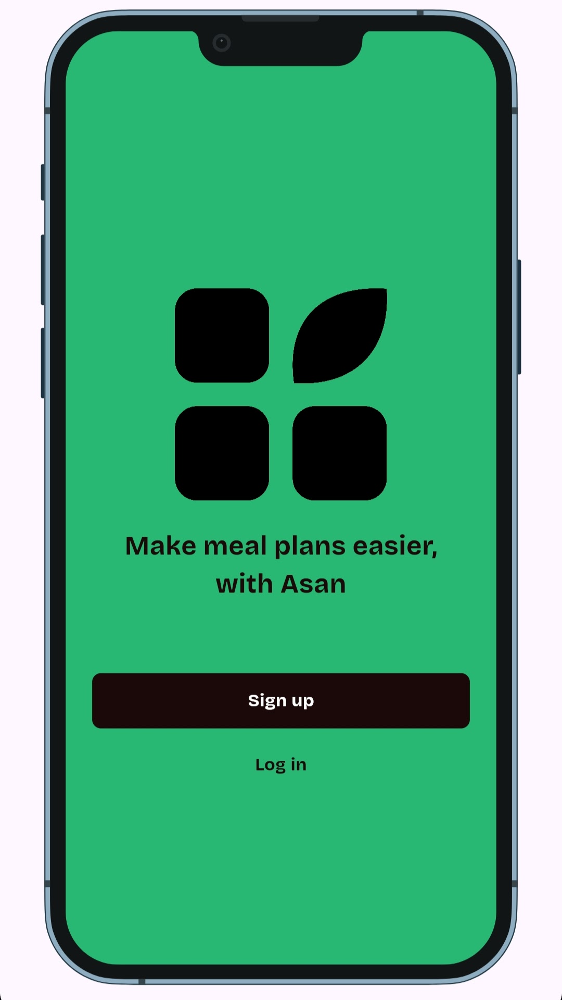 | 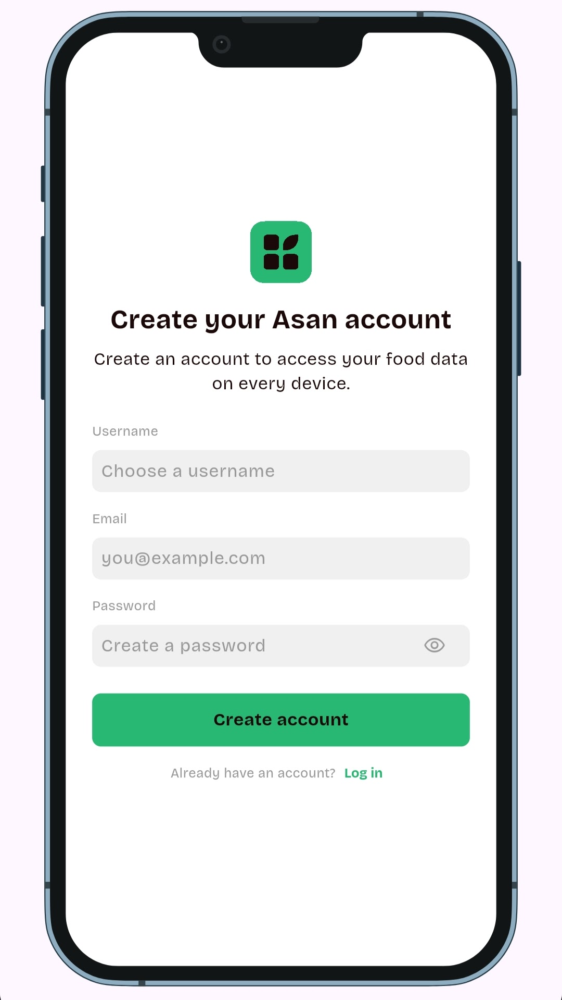 | 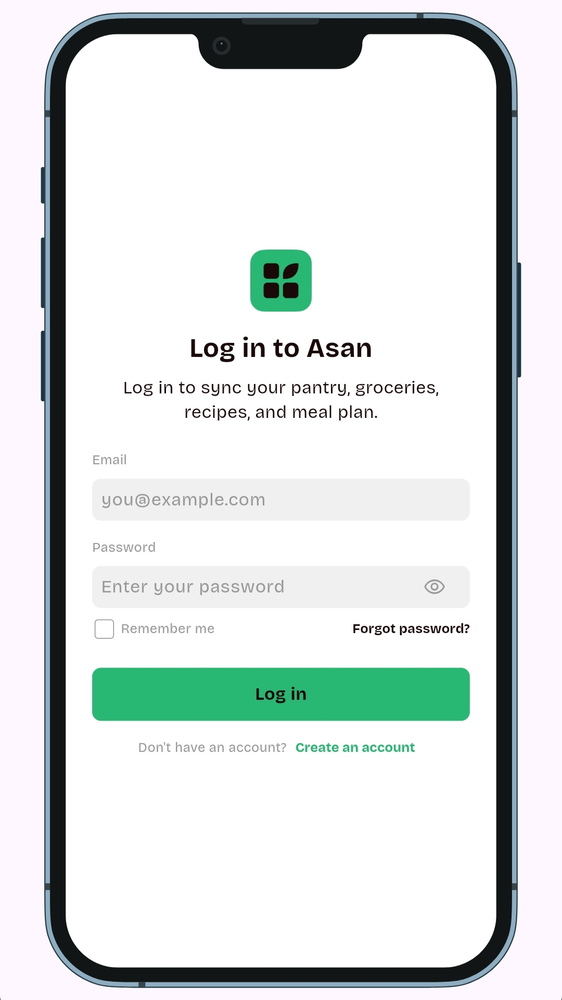 |

| Recipes (Explore) | Recipes (Saved) | Recipes (My Recipes) |
| --- | --- | --- |
| 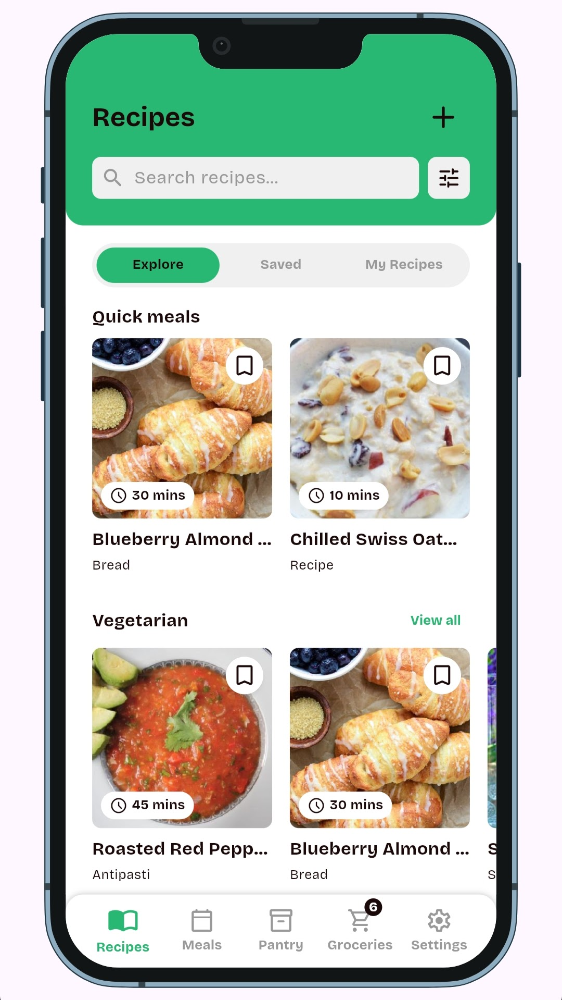 | 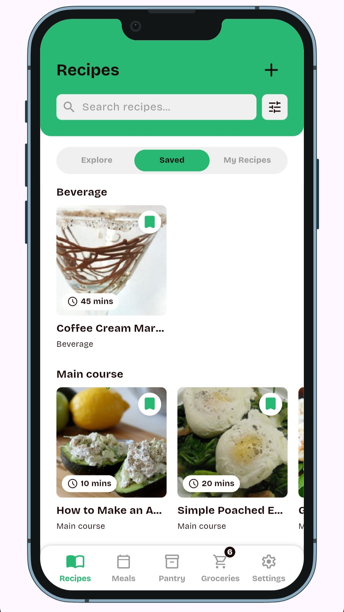 | 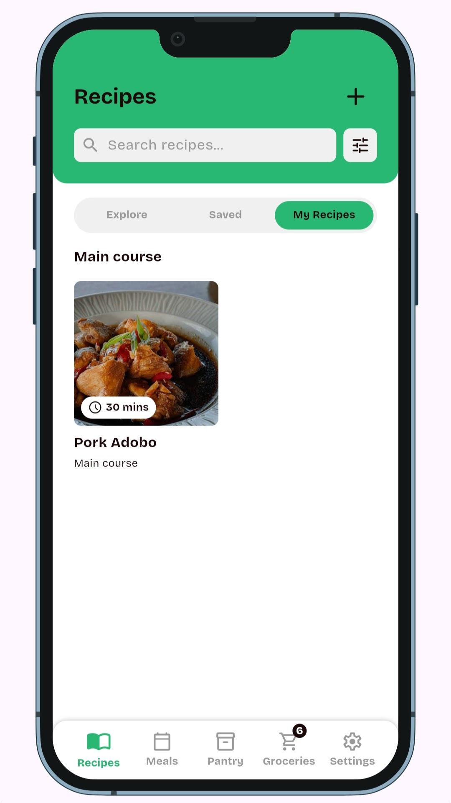 |

| Recipe Details | Search Recipes | Add Recipe |
| --- | --- | --- |
| 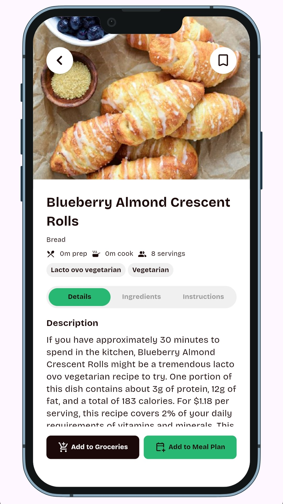 | 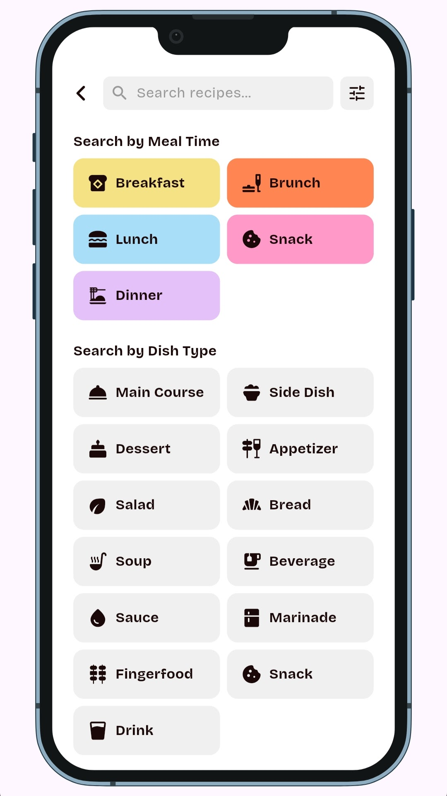 | 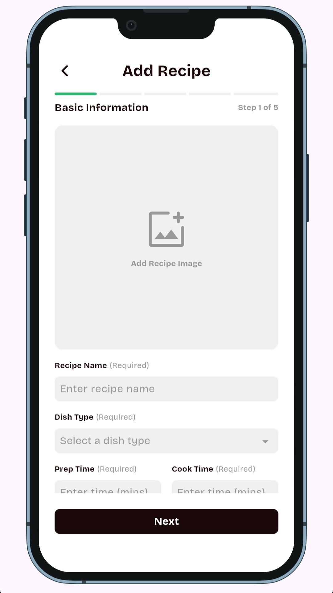 |

| Meal Plan (Day) | Meal Plan (Week) | Add Meal to Plan |
| --- | --- | --- |
| 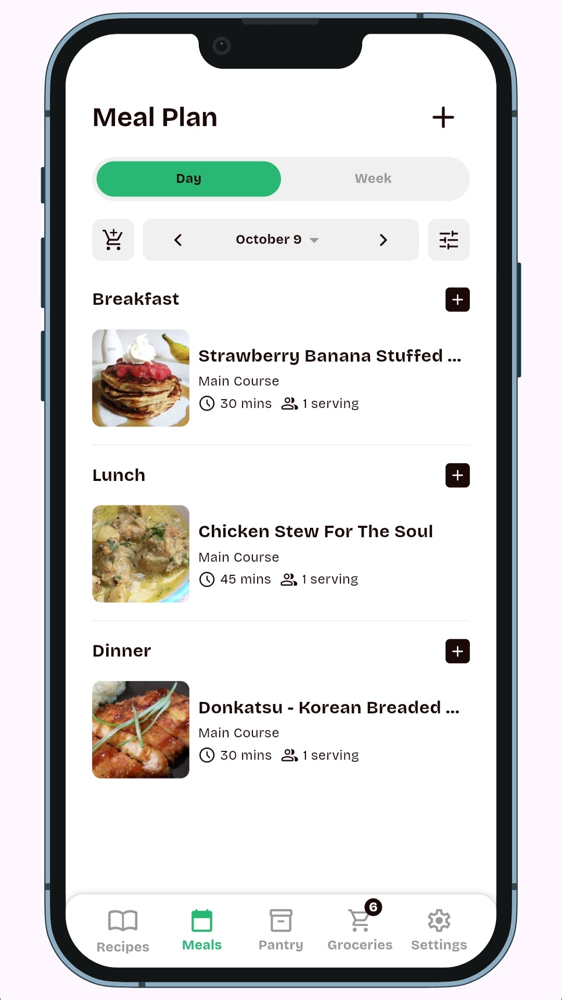 | 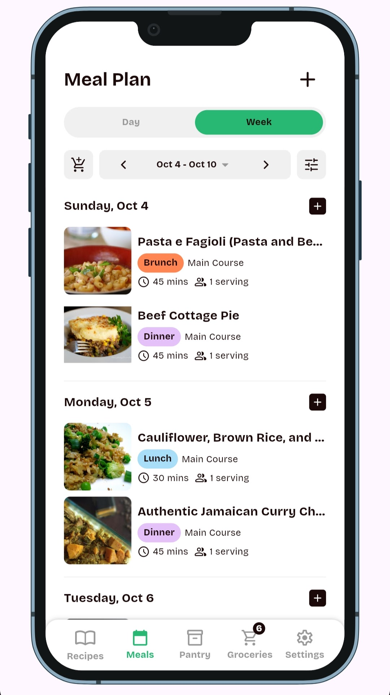 | 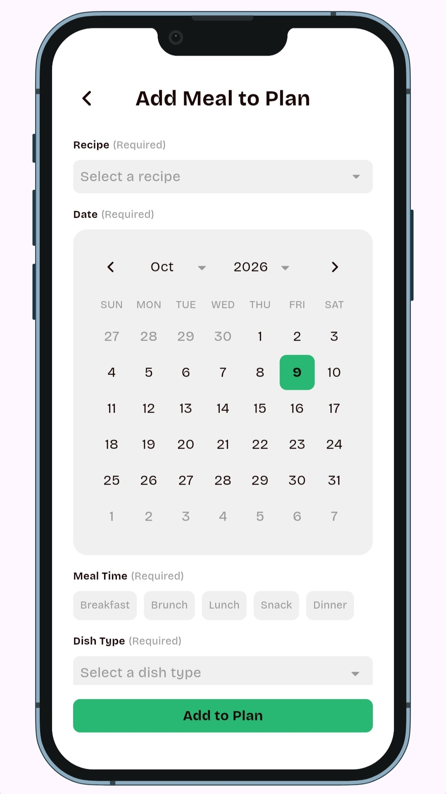 |

| Pantry | Add Pantry Item | Groceries |
| --- | --- | --- |
| 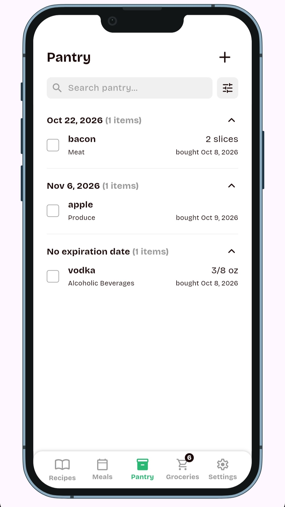 | 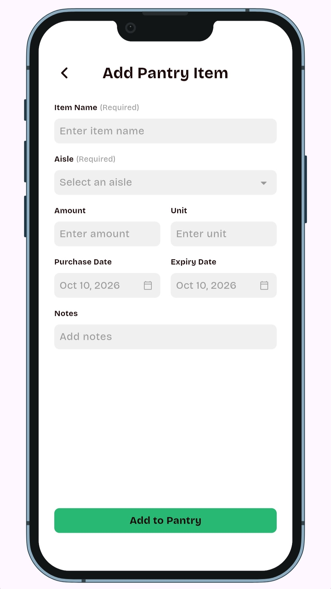 | 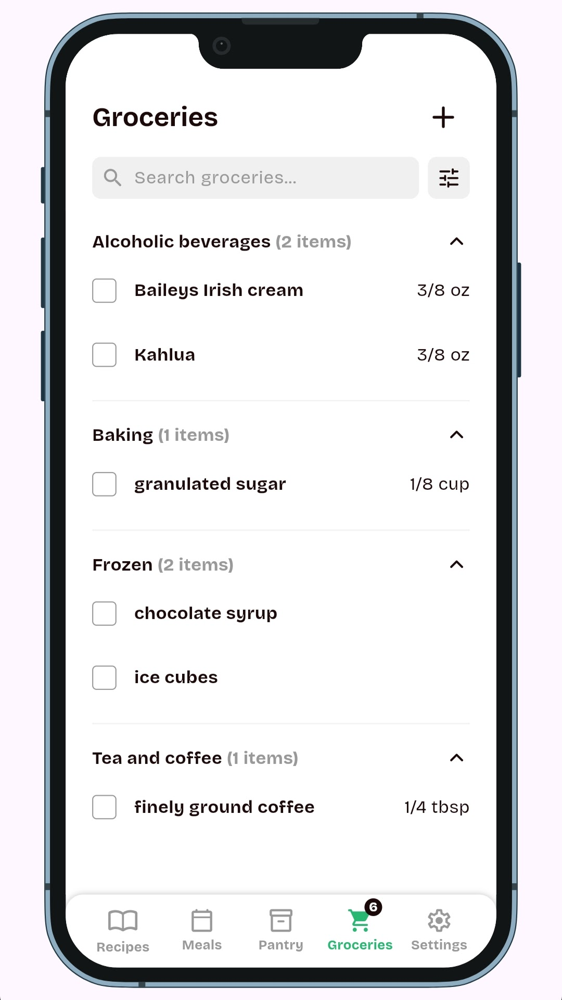 |

| Add Grocery Item | Settings |
| --- | --- |
| 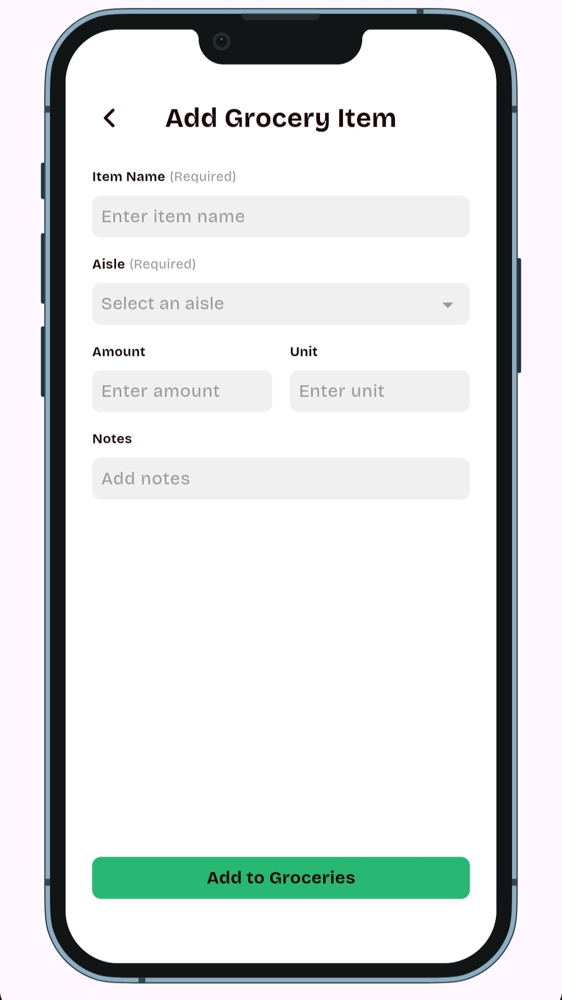 | 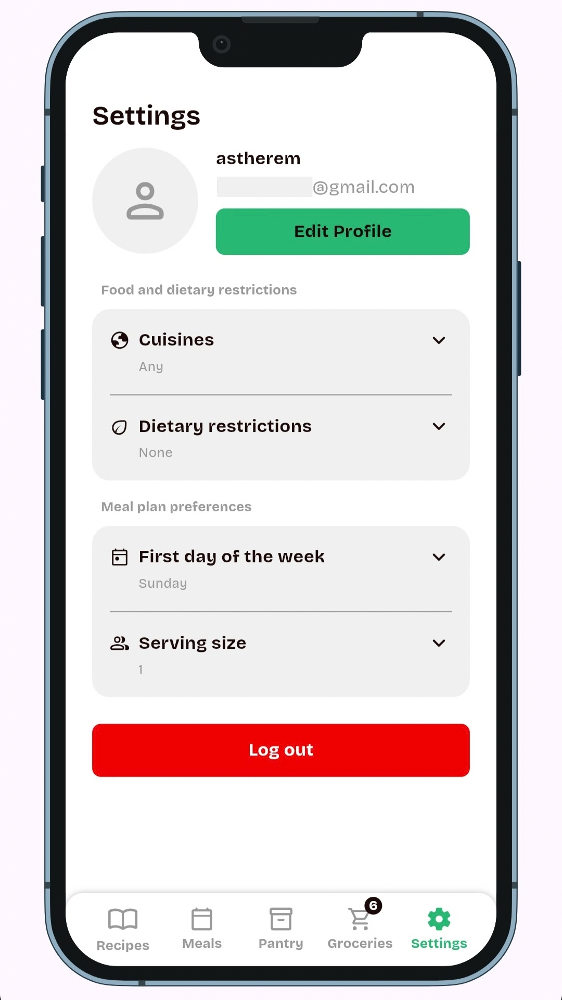 |

## 7. Known issues and next steps

**Current known limitations:**

- Explore tab depends on the Supabase Edge Function and the Spoonacular service/quota. Configure and deploy the function before expecting Explore results.
- Cloud sync requires a configured Supabase project, the `user_data` migration,
  email authentication, and a signed-in user. Local Hive storage remains
  available when Supabase is not configured.
- Sync resolves same-record changes with timestamps and preserves deletions
  with tombstones, but it does not resolve concurrent field-level edits or
  provide a user-facing conflict history.

- Pantry and grocery forms reject duplicate items with the same name and aisle.
  Other duplicate cases and broader input edge cases are not handled uniformly
  across the app.

**Planned next steps:**

1. Expand validation and duplicate handling across forms, and show clearer
   feedback when saves fail.
2. Add field-level conflict resolution and user-facing sync status for
   multi-device edits.
3. Verify the deployed Explore configuration and update screenshots to match
   the current app UI.

## Security checklist

See the [Security Checklist](SECURITY-CHECKLIST.md) for the repository review and [Security and Privacy](docs/06-security-and-privacy.md) for stored data, service-side protections, and privacy details. The [project documentation index](docs/README.md) links the proposal, design, weekly reports, and mockups.

## Credits

- **Packages:** see [`pubspec.yaml`](pubspec.yaml)
- **Fonts:** Bricolage Grotesque by Mathieu Triay, licensed under the [SIL Open Font License, Version 1.1](https://openfontlicense.org/open-font-license-official-text/)
- **Icons:** Material Symbols and Icons by Google and Tim Maffett, licensed under the [Apache License Version 2.0](https://www.apache.org/licenses/LICENSE-2.0)
- **Recipe mockup images:** [Nutrient Matters](https://nutrient-matters.com/) by Sara Abdul-Aziz
- **Shakshuka mockup recipe description:** [5-Minute High-Fiber Breakfast: Shakshuka](https://nutritionbykylie.substack.com/p/5-minute-high-fiber-breakfast-shakshuka?utm_source=publication-search) by Kylie Sakaida

## AI usage

[](AI-USAGE.md)

The app was developed with Codex and Copilot for code suggestions, debugging, API integration, and documentation, while the final implementation was reviewed and adjusted by the author. See [AI Usage](AI-USAGE.md) for more details. 

## License

Copyright © 2026 astherem. [MIT License](LICENSE).
